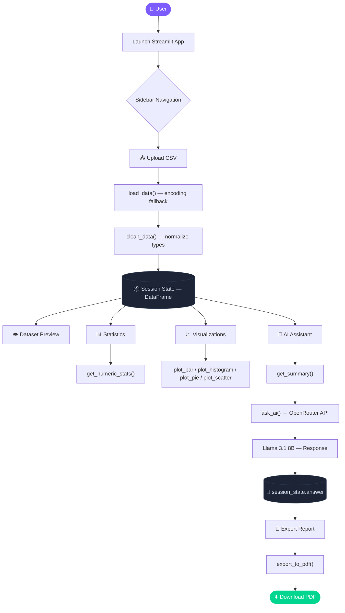

<div align="center">

# ✦ PROJECT OVERVIEW

### Data Analysis Assistant

<p>
  Upload any CSV dataset and transform it into interactive visualizations,<br/>
  statistical summaries, and AI-generated insights — all in minutes.
</p>

[](#)
[](#)
[](#)
[](#)
[](#)

</div>

---

## 📌 Overview

**DataMind AI** is a modular Streamlit web application for interactive CSV data exploration.  
It combines automated cleaning, Plotly visualizations, descriptive statistics, and a natural-language AI assistant — all accessible through a clean, sidebar-navigated interface.

> **Stack:** Python · Streamlit · Pandas · Plotly · OpenRouter (Llama 3.1) · FPDF

---

## ✨ Features

|  | Feature | Description |
|:---:|:---|:---|
| 📤 | **CSV Upload** | Drag-and-drop any `.csv` file; encoding fallbacks handled automatically |
| 🧹 | **Auto-Clean** | Deduplication, missing-value detection, and type normalization |
| 👁 | **Dataset Preview** | Full table view with row, column, and missing value summary |
| 📊 | **Statistics** | Numeric `describe()`, per-column missing values, and categorical counts |
| 📈 | **Visualizations** | Bar, Histogram, Pie, and Scatter plots powered by Plotly |
| 🤖 | **AI Assistant** | Ask natural-language questions via Llama 3.1 8B on OpenRouter |
| 📄 | **PDF Export** | Download AI-generated analysis as a professional PDF report |

---

## 🗂 Repository Structure

```text
ali/
├── main.py              # App entrypoint — routing, UI, session state
├── analysis.py          # Data loading, cleaning, statistics, PDF export
├── visualization.py     # Plotly chart generators
├── ai_helper.py         # OpenRouter AI client and question handler
├── requirements.txt     # Python dependencies
├── .env                 # API key (not committed)
├── .gitignore
└── README.md
```

---

## 🚀 Getting Started

### 1 · Clone the Repository

```bash
git clone https://github.com/abdullahkamran426-lab/ai_anylist_assistand.git
cd datamind-ai
```

### 2 · Create & Activate a Virtual Environment

```powershell
# Windows (PowerShell)
python -m venv .venv
.\.venv\Scripts\Activate.ps1
```

```bash
# macOS / Linux
python -m venv .venv
source .venv/bin/activate
```

### 3 · Install Dependencies

```bash
pip install -r requirements.txt
```

### 4 · Configure the Environment

Create a `.env` file in the project root:

```env
OPENROUTER_API_KEY=your_openrouter_api_key_here
```

> 🔑 Get your free API key at [openrouter.ai/keys](https://openrouter.ai/keys)

### 5 · Launch the App

```bash
streamlit run main.py
```

The app will open at `http://localhost:8501`.

---

## 🔄 Application Workflow



---

## 🧩 Module Reference

<details>
<summary><strong>📄 main.py — Application Controller</strong></summary>
<br/>

Handles all page routing, session-state initialization, and UI rendering. Integrates with all helper modules.

| Page | Purpose |
|:---|:---|
| Home | App introduction and feature overview |
| Upload Dataset | CSV upload, encoding handling, cleaning, session storage |
| Dataset Preview | Full table view, column types, missing value counts |
| Statistics | Numeric stats, missing analysis, categorical counts |
| Visualizations | Interactive Plotly chart builder |
| AI Assistant | Natural-language question answering |
| Export Report | AI-response PDF generation and download |
| About | App description and technology stack |

</details>

<details>
<summary><strong>🔧 analysis.py — Data & Export Utilities</strong></summary>
<br/>

| Function | Signature | Description |
|:---|:---|:---|
| `load_data` | `(uploaded_file)` | Reads CSV with encoding fallbacks (`utf-8` → `cp1252` → `latin1`). Cached with `@st.cache_data`. |
| `clean_data` | `(df)` | Strips commas from `Gross` column and casts it to numeric. Returns cleaned DataFrame. |
| `get_summary` | `(df, filename)` | Builds a text snapshot (filename, shape, dtypes, head, describe) for the AI prompt. |
| `get_numeric_stats` | `(df)` | Returns `df.describe()` for numeric columns, or `None` if none exist. |
| `get_category_counts` | `(df, col)` | Returns `value_counts()` for a given categorical column. |
| `export_to_pdf` | `(text, filename)` | Writes AI response to a PDF via FPDF, stripping non-ASCII characters first. |

</details>

<details>
<summary><strong>📈 visualization.py — Chart Generators</strong></summary>
<br/>

All functions return a **Plotly figure object** ready for `st.plotly_chart()`.

| Function | Chart Type | Notes |
|:---|:---|:---|
| `plot_bar(df, col)` | Bar chart | Top 15 value counts of a categorical column |
| `plot_histogram(df, col)` | Histogram | 30 bins across a numeric column |
| `plot_pie(df, col)` | Pie chart | Top 8 categories of a categorical column |
| `plot_scatter(df, x, y)` | Scatter plot | Two numeric columns on X and Y axes |

</details>

<details>
<summary><strong>🤖 ai_helper.py — AI Integration</strong></summary>
<br/>

| Setting | Value |
|:---|:---|
| Provider | OpenRouter (OpenAI-compatible API) |
| Model | `meta-llama/llama-3.1-8b-instruct` |
| `max_tokens` | `500` |
| `temperature` | `0.3` |
| Fallback | Returns a descriptive error string if the API key is missing or a request fails |

**`ask_ai(question, dataset_summary)`**  
Sends a combined prompt — dataset context and user question — to the model and returns the generated response string.

</details>

---

## 📦 Dependencies

| Library | Purpose | Active |
|:---|:---|:---:|
| `streamlit` | Web UI framework | ✅ |
| `pandas` | Data loading and manipulation | ✅ |
| `plotly` | Interactive chart rendering | ✅ |
| `fpdf` | PDF report generation | ✅ |
| `openai` | OpenRouter-compatible AI client | ✅ |
| `python-dotenv` | `.env` variable loading | ✅ |
| `numpy` | Numeric utilities | ✅ |
| `matplotlib` | Installed — not yet wired | ⬜ |
| `seaborn` | Installed — not yet wired | ⬜ |

---

## ⚙️ Configuration Reference

| Variable | File | Description |
|:---|:---|:---|
| `OPENROUTER_API_KEY` | `.env` | Your OpenRouter API key — required for the AI assistant |

---

## 📝 Notes

- The **AI assistant is optional** — all other features work without an API key configured.
- `clean_data()` currently targets a `Gross` column specifically. Extend it in `analysis.py` for your dataset's structure.
- `matplotlib` and `seaborn` are in `requirements.txt` but not yet wired to any charts — swap Plotly functions in `visualization.py` if you prefer them.

---

## 📜 License

This project is licensed under the **MIT License** — see [`LICENSE`](LICENSE) for details.

---

<div align="center">
  Built with 🐍 Python &nbsp;·&nbsp; ⚡ Streamlit &nbsp;·&nbsp; 🤖 OpenRouter
</div>
