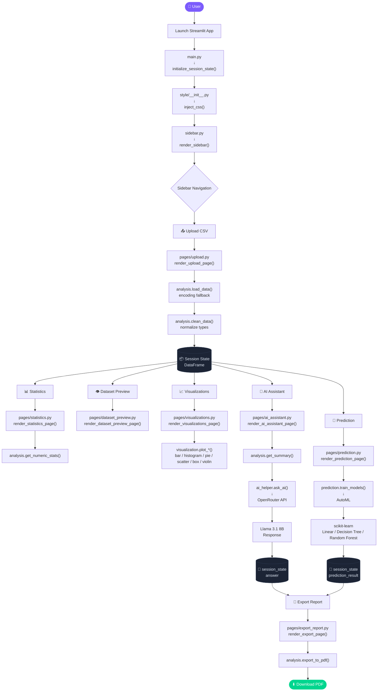

<div align="center">

# ✦ PROJECT OVERVIEW

### DataLens — AI Data Analysis Assistant

<p>
  Upload any CSV dataset and transform it into interactive visualizations,<br/>
  statistical summaries, AI-generated insights, and machine learning predictions — all in minutes.
</p>

[](#)
[](#)
[](#)
[](#)
[](#)

**🌐 Live App:** [https://aianylistassistand-e4ufhunamkwkljyylj6col.streamlit.app/](https://aianylistassistand-e4ufhunamkwkljyylj6col.streamlit.app/)

</div>

---

## 📌 Overview

**DataLens** is a modular Streamlit web application for interactive CSV data exploration and analysis.  
It combines automated cleaning, Plotly visualizations, descriptive statistics, natural-language AI assistance, and AutoML predictions — all accessible through a clean, sidebar-navigated interface.

> **Stack:** Python · Streamlit · Pandas · Plotly · OpenRouter (Llama 3.1) · scikit-learn · FPDF2

---

## ✨ Features

|  | Feature | Description |
|:---:|:---|:---|
| 📤 | **CSV Upload** | Drag-and-drop any `.csv` file; encoding fallbacks handled automatically |
| 🧹 | **Auto-Clean** | Deduplication, missing-value detection, and type normalization |
| 👁 | **Dataset Preview** | Full table view with row, column, and missing value summary |
| 📊 | **Statistics** | Numeric `describe()`, per-column missing values, and categorical counts |
| 📈 | **Visualizations** | Bar, Histogram, Pie, Scatter, Box, Violin, Line, Area, and more via Plotly |
| 🤖 | **AI Assistant** | Ask natural-language questions via Llama 3.1 8B on OpenRouter |
| 🔮 | **AutoML Prediction** | Train ML models (Linear, Decision Tree, Random Forest) for classification/regression |
| 📄 | **PDF Export** | Download comprehensive analysis as a professional PDF report |

---

## 🗂 Repository Structure

```text
ai_anylist_assistand/
├── main.py              # App entrypoint — routing, UI, session state
├── modules/             # Helper modules package
│   ├── __init__.py      # Package marker
│   ├── analysis.py      # Data loading, cleaning, statistics, PDF export, AutoML
│   ├── visualization.py # Plotly chart generators
│   ├── ai_helper.py     # OpenRouter AI client and question handler
│   ├── prediction.py    # AutoML model training and prediction
│   ├── config.py        # Configuration constants
│   ├── session.py       # Session state management
│   ├── sidebar.py       # Sidebar rendering
│   ├── utils.py         # Helper functions
│   ├── pages/           # Page rendering functions (package)
│   │   ├── __init__.py  # Re-exports all render_* functions
│   │   ├── home.py      # Landing page
│   │   ├── upload.py    # CSV upload & auto-clean
│   │   ├── clean_data.py # Interactive data cleaning
│   │   ├── dataset_preview.py # Table view
│   │   ├── statistics.py # Numeric stats & categories
│   │   ├── visualizations.py # Plotly charts
│   │   ├── ai_assistant.py # AI Q&A interface
│   │   ├── prediction.py # AutoML model training UI
│   │   ├── export_report.py # PDF report generation
│   │   └── about.py     # App information
│   └── style/           # CSS styling (package)
│       ├── __init__.py  # Aggregates all CSS modules
│       ├── base.py      # Font imports & color palette
│       ├── sidebar.py   # Sidebar styling
│       ├── widgets.py   # Generic widget styling
│       ├── layout.py    # Layout components
│       ├── upload.py    # Upload page styling
│       └── explore.py   # Stats/Visualizations styling
├── requirements.txt     # Python dependencies
├── .env                 # API key (not committed)
├── .env.example        # API key template
├── .gitignore
└── README.md
```

---

## 🚀 Getting Started

### 1 · Clone the Repository

```bash
git clone https://github.com/abdullahkamran426-lab/ai_anylist_assistand.git
cd ai_anylist_assistand
```

### 2 · Create & Activate a Virtual Environment

```powershell
# Windows (PowerShell)
python -m venv .venv
.\.venv\Scripts\Activate.ps1
```

```bash
# macOS / Linux
python -m venv .venv
source .venv/bin/activate
```

### 3 · Install Dependencies

```bash
pip install -r requirements.txt
```

### 4 · Configure the Environment

Create a `.env` file in the project root:

```env
OPENROUTER_API_KEY=your_openrouter_api_key_here
```

> 🔑 Get your free API key at [openrouter.ai/keys](https://openrouter.ai/keys)

### 5 · Launch the App

```bash
streamlit run main.py
```

The app will open at `http://localhost:8501`.

---

## 🔄 Application Workflow



---

## 🧩 Module Reference

<details>
<summary><strong>📄 main.py — Application Orchestrator</strong></summary>
<br/>

Clean entry point that delegates all functionality to modules. Handles page routing, session state initialization, CSS injection, and sidebar rendering.

| Section | Purpose |
|:---|:---|
| Imports | Imports from modules package (style, session, sidebar, pages) |
| Page Config | Sets Streamlit page title, icon, and layout |
| CSS Injection | Calls `inject_css()` from `style` package |
| Session Init | Calls `initialize_session_state()` from `session` module |
| Sidebar | Calls `render_sidebar()` to get selected page |
| Page Routing | Routes to appropriate `render_*()` function from `pages` package |

</details>

<details>
<summary><strong>📦 modules/config.py — Configuration Constants</strong></summary>
<br/>

Centralized application configuration.

| Constant | Description |
|:---|:---|
| `LARGE_DF_THRESHOLD` | Row count threshold for sampling (default: 50,000) |
| `NAV_OPTIONS` | List of page names for sidebar navigation |
| `SESSION_STATE_DEFAULTS` | Dictionary of default session state values |

</details>

<details>
<summary><strong>🎨 modules/style/ — CSS Styling Package</strong></summary>
<br/>

Contains all custom CSS for the application, split across focused modules for maintainability.

| Module | Description |
|:---|:---|
| `base.py` | Google Font imports, CSS custom property palette (--accent, --card, --border, etc.), base html/body rules |
| `sidebar.py` | Sidebar navigation re-skin |
| `widgets.py` | Generic Streamlit widget skins (buttons, dataframe, input fields, etc.) |
| `layout.py` | Custom layout primitives shared across pages (.hero, .pill, .section-label, .panel, etc.) |
| `upload.py` | Upload Dataset page-specific styling |
| `explore.py` | Dataset Preview / Statistics / Visualizations page styling |
| `__init__.py` | Aggregates all CSS modules and exports `inject_css()` and `get_css()` |

**Public API:** `inject_css()` — called once at the start of main.py to inject the complete compiled stylesheet.

</details>

<details>
<summary><strong>💾 modules/session.py — Session State Management</strong></summary>
<br/>

Manages Streamlit session state initialization and cleanup.

| Function | Description |
|:---|:---|
| `initialize_session_state()` | Initializes all session state variables with defaults |
| `clear_dataset_state()` | Clears dataset-related session state (df, filename, logs, etc.) |

</details>

<details>
<summary><strong>📋 modules/sidebar.py — Sidebar Rendering</strong></summary>
<br/>

Renders the application sidebar with navigation, dataset status, and branding.

| Function | Description |
|:---|:---|
| `render_sidebar()` | Renders complete sidebar and returns selected page name |

Includes: logo with pulsing AI status, navigation radio, dataset status badge (with health percentage), clear dataset button, and footer.

</details>

<details>
<summary><strong>🛠️ modules/utils.py — Helper Functions</strong></summary>
<br/>

Utility functions used throughout the application.

| Function | Description |
|:---|:---|
| `section(label, title)` | Renders consistent section header pattern |
| `sample_df_for_speed(frame, enabled, n)` | Returns sampled dataframe for large datasets |

</details>

<details>
<summary><strong>📄 modules/pages/ — Page Rendering Functions Package</strong></summary>
<br/>

All page rendering functions for the application, split into one module per page for scalability and maintainability.

| Module | Function | Description |
|:---|:---|:---|
| `home.py` | `render_home_page()` | Landing page with app overview and feature cards |
| `upload.py` | `render_upload_page()` | CSV upload with auto-clean and success banner |
| `clean_data.py` | `render_clean_data_page()` | Interactive data cleaning with live preview |
| `dataset_preview.py` | `render_dataset_preview_page()` | Full table view with column details |
| `statistics.py` | `render_statistics_page()` | Numeric stats, missing values, value counts |
| `visualizations.py` | `render_visualizations_page()` | Plotly chart builder (bar, histogram, pie, scatter, box, violin, etc.) |
| `ai_assistant.py` | `render_ai_assistant_page()` | Natural-language Q&A with conversation history |
| `prediction.py` | `render_prediction_page()` | AutoML model training and prediction interface |
| `export_report.py` | `render_export_page()` | PDF report generation and download |
| `about.py` | `render_about_page()` | App information and technology stack |

**Public API:** `__init__.py` re-exports all `render_*` functions, so imports in main.py remain unchanged: `from modules.pages import render_home_page, render_upload_page, ...`

</details>

<details>
<summary><strong>🔧 modules/analysis.py — Data & Export Utilities</strong></summary>
<br/>

| Function | Signature | Description |
|:---|:---|:---|
| `load_data` | `(uploaded_file)` | Reads CSV with encoding fallbacks (`utf-8` → `cp1252` → `latin1`). Cached with `@st.cache_data`. |
| `clean_data` | `(df)` | Strips commas from numeric columns and casts to proper types. Returns cleaned DataFrame. |
| `get_summary` | `(df, filename)` | Builds a text snapshot (filename, shape, dtypes, head, describe) for the AI prompt. |
| `get_numeric_stats` | `(df)` | Returns `df.describe()` for numeric columns, or `None` if none exist. |
| `get_category_counts` | `(df, col)` | Returns `value_counts()` for a given categorical column. |
| `export_dataset_report` | `(df, filename, ai_answer)` | Generates comprehensive PDF report with statistics, charts, and AI insights. |
| `clean_pdf_text` | `(text)` | Sanitizes text for PDF compatibility (ASCII-only, truncation, printable characters). |

**PDF Generation:** Uses FPDF2 library with robust text handling to prevent horizontal space errors. Includes automatic truncation, Unicode sanitization, and exception handling for reliable PDF output.

</details>

<details>
<summary><strong>📈 modules/visualization.py — Chart Generators</strong></summary>
<br/>

All functions return a **Plotly figure object** ready for `st.plotly_chart()`.

| Function | Chart Type | Notes |
|:---|:---|:---|
| `plot_bar(df, col)` | Bar chart | Top 15 value counts of a categorical column |
| `plot_histogram(df, col)` | Histogram | 30 bins across a numeric column |
| `plot_pie(df, col)` | Pie chart | Top 8 categories of a categorical column |
| `plot_scatter(df, x, y)` | Scatter plot | Two numeric columns with OLS trendline |
| `plot_box(df, col)` | Box plot | Distribution analysis for numeric columns |
| `plot_violin(df, col)` | Violin plot | Distribution with box plot overlay |
| `plot_line(df, x, y)` | Line chart | Time series or sequential data |
| `plot_area(df, x, y)` | Area chart | Cumulative data visualization |
| `plot_bubble(df, x, y, size)` | Bubble chart | Three-dimensional scatter plot |
| `plot_treemap(df, path, values)` | Treemap | Hierarchical data visualization |
| `plot_sunburst(df, path, values)` | Sunburst | Multi-level hierarchical data |
| `plot_correlation_matrix(df)` | Heatmap | Correlation matrix for numeric columns |

**Dependencies:** Requires `statsmodels` for trendline in scatter plots.

</details>

<details>
<summary><strong>🤖 modules/ai_helper.py — AI Integration</strong></summary>
<br/>

| Setting | Value |
|:---|:---|
| Provider | OpenRouter (OpenAI-compatible API) |
| Model | `meta-llama/llama-3.1-8b-instruct` |
| `max_tokens` | `500` |
| `temperature` | `0.3` |
| Timeout | `30 seconds` |
| Fallback | Returns a descriptive error string if the API key is missing or a request fails |

**`ask_ai(question, dataset_summary)`**  
Sends a combined prompt — dataset context and user question — to the model and returns the generated response string.

</details>

<details>
<summary><strong>🔮 modules/prediction.py — AutoML Module</strong></summary>
<br/>

Automated machine learning for classification and regression problems using scikit-learn.

| Function | Description |
|:---|:---|
| `detect_problem_type(df, target)` | Infers classification vs regression based on target dtype and unique values |
| `prepare_data(df, target)` | Separates features/target, identifies categorical/numerical columns, creates preprocessing pipelines |
| `train_models(df, target)` | Main AutoML function that trains multiple models and returns the best performer |
| `predict_with_model(model, df, target)` | Makes predictions using trained model with same preprocessing |
| `save_prediction_model(model, path)` | Saves trained model to disk as .pkl file |
| `load_prediction_model(path)` | Loads saved model from disk |

**Models Supported:**
- **Classification:** Logistic Regression, Decision Tree Classifier, Random Forest Classifier
- **Regression:** Linear Regression, Decision Tree Regressor, Random Forest Regressor

**Data Preprocessing:**
- Numeric features: median imputation
- Categorical features: most frequent imputation + one-hot encoding
- Automatic missing value handling
- ColumnTransformer for pipeline integration

**Evaluation Metrics:**
- Classification: accuracy, precision, recall, f1-score, confusion matrix
- Regression: R², MAE, MSE, RMSE

</details>

---

## 📦 Dependencies

| Library | Purpose | Active |
|:---|:---|:---:|
| `streamlit` | Web UI framework | ✅ |
| `pandas` | Data loading and manipulation | ✅ |
| `numpy` | Numeric utilities and array operations | ✅ |
| `plotly` | Interactive chart rendering | ✅ |
| `matplotlib` | Static chart generation (backup) | ✅ |
| `seaborn` | Statistical visualization (backup) | ✅ |
| `statsmodels` | Statistical models for trendlines | ✅ |
| `scikit-learn` | Machine learning models and preprocessing | ✅ |
| `joblib` | Model serialization | ✅ |
| `fpdf2` | PDF report generation | ✅ |
| `openai` | OpenRouter-compatible AI client | ✅ |
| `python-dotenv` | `.env` variable loading | ✅ |

---

## 🛠 Technology Stack

| Technology | Why It's Used |
|:---|:---|
| **Python** | Primary language - extensive data science ecosystem, easy to read, great for rapid prototyping |
| **Streamlit** | Web UI framework - enables building interactive data apps with pure Python, no HTML/CSS/JS knowledge required, perfect for data tools |
| **Pandas** | Data manipulation - industry-standard for CSV loading, cleaning, and statistical analysis, powerful DataFrame operations |
| **Plotly** | Interactive visualizations - creates beautiful, interactive charts that work in browsers, better than static matplotlib for web apps |
| **scikit-learn** | Machine learning - comprehensive library for classification, regression, preprocessing, and model evaluation |
| **OpenRouter (Llama 3.1)** | AI integration - provides access to state-of-the-art LLMs for natural-language data analysis, cost-effective alternative to OpenAI |
| **FPDF2** | PDF generation - lightweight library for creating downloadable reports without complex dependencies |
| **OpenAI SDK** | AI client - OpenRouter-compatible client for making API calls to LLMs with proper error handling |
| **python-dotenv** | Environment management - securely loads API keys from `.env` files, prevents hardcoding sensitive data |
| **NumPy** | Numerical computing - efficient array operations, used by pandas for numeric column detection and statistics |
| **statsmodels** | Statistical models - provides advanced statistical analysis and trendline calculations for scatter plots |
| **joblib** | Model serialization - efficient serialization of trained ML models for saving and loading |

---

## ⚙️ Configuration Reference

| Variable | File | Description |
|:---|:---|:---|
| `OPENROUTER_API_KEY` | `.env` | Your OpenRouter API key — required for the AI assistant |

---

## 📝 Notes

- The **AI assistant is optional** — all other features work without an API key configured.
- **PDF Generation:** The app uses FPDF2 with robust text handling (ASCII encoding, truncation, exception handling) to prevent horizontal space errors during PDF report generation.
- **AutoML Prediction:** The prediction module automatically detects classification vs regression problems and trains multiple models (Linear, Decision Tree, Random Forest) to find the best performer.
- **Large Datasets:** For datasets with 100,000+ rows, the app offers sampling options to maintain responsive performance during statistics and visualizations.
- **Data Cleaning:** The current cleaning function handles common issues like comma-separated numbers and type normalization. Extend it in `analysis.py` for specific dataset requirements.
- **Chart Types:** While matplotlib and seaborn are available as dependencies, the app primarily uses Plotly for interactive web-friendly visualizations.

---

<div align="center">
  Built with 🐍 Python &nbsp;·&nbsp; ⚡ Streamlit &nbsp;·&nbsp; 🤖 OpenRouter &nbsp;·&nbsp; 🧠 scikit-learn
</div>
